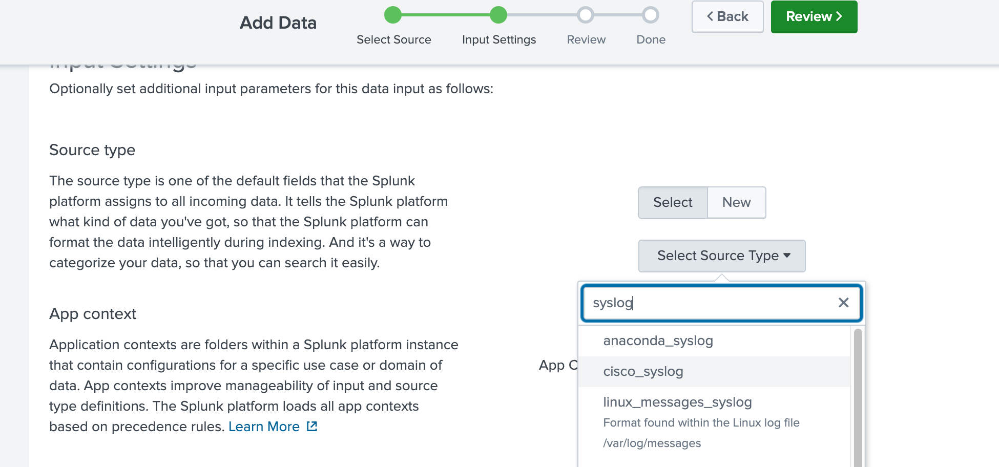
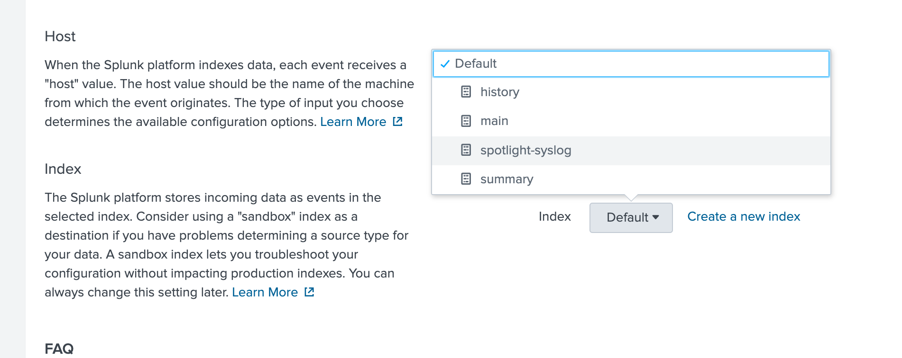
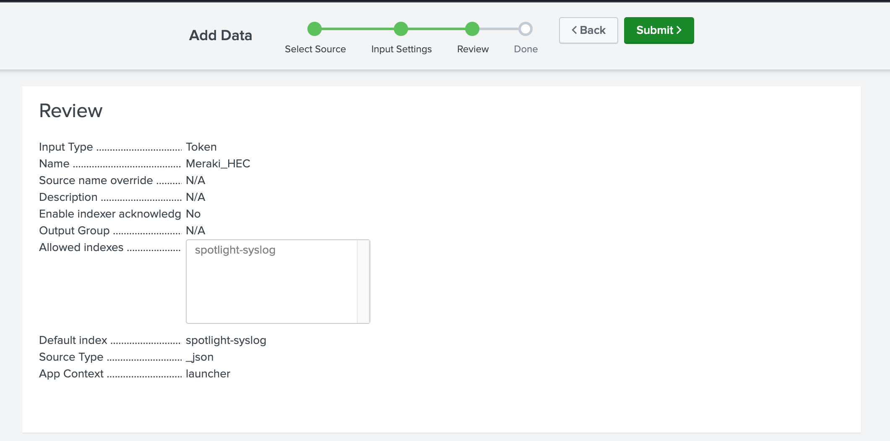

# Cisco U. Spotlight 2025 - "Splunk"ing Your Way to Self-Healing Networks"

## Overview

Thsis repository contains the code and resources for the Cisco U. Spotlight 2025 session on "Splunk"ing Your Way to Self-Healing Networks". The session focuses on how to leverage Splunk's capabilities to create self-healing networks, enhancing network reliability and performance, using outbound webhooks from Splunk to a webhook receiver which parses the received information and use it to drive automations based on SSH and API-based information.  **This is not production code** and it is intended for educational purposes only. The code is provided as-is and should be used at your own risk. Please ensure you have the necessary permissions and understanding before running any scripts or automations in a production environment.

## Assets

There are several folders included within this repository to aid in your self-healing network journey.

- [`meraki`](https://github.com/qsnyder/spotlight-2025/tree/main/meraki) -- this includes the webhook listener and Python requirements needed to create the webhook receiver that will listen to events from Splunk, pass them to a Webex messaging webhook room, and then use the resulting information to drive automation by looking at a change and comparing it to what exists within Netbox, which is used as a single source of truth for IP information.
- [`syslog`](https://github.com/qsnyder/spotlight-2025/tree/main/syslog) -- this includes the webhook listener and Python requirements needed to create the webhook receiver that will listen to the resulting webhooks generated from syslog messages into Splunk.  This listener will forward information to a Webex messaging webhook room, and then use the resulting information to drive automation based on a regular expression query of the syslog data.  The change will be performed using SSH and Netmiko against the device that generated the syslog message.
- [`webhook-examples`](https://github.com/qsnyder/spotlight-2025/tree/main/webhook-examples) -- this includes examples of the webhook payloads that were generated as part of this session.  It includes webhooks from Meraki for both an API-related as well as a dashboard-initiated change, as well as a syslog webhook that was initiated from Splunk.  These examples are provided to help you understand the structure of the webhooks and how to parse them for your own use cases.
- [`assets`](https://github.com/qsnyder/spotlight-2025/tree/main/assets) -- this folder includes the sample topology used within CML for the syslog-based segment of the session.

## Scaffolding the Splunk Instance

You'll need to create several different components to segregate the data within the platform.  Some of these are optional (and will be noted as such), while others are required in order to ingest the data.

### Indexes for Data

#### Defining What Requires an Index

Different sets of data can be placed into different indexes, depending on the requirements and needs of your organization.  While the scope of "why" you would do this is beyond the scope of this session, there are a few general best practices:

- **Does the data need to be segmented via Role-Based Access Control (RBAC)?**
  - If the data needs to be segmented from the view of different users, it will need to be placed in a unique index
- **Do unique data retention requirements exist between types of data?**
  - Data retention is defined *per index*, so if there are different requirements, different indexes will be required
- **Do the different data sources have different data volumes?**
  - While not a massive issue, if you have data sources that generate 1000s of events per hour, while another source that generates a few events per day -- you may want to segment the data purely from a refinement and visibility standpoint

Splunk **does not** require different data types/structures to be segmented into different indexes, so that does not need to be a defining factor.

#### Creating the Index

If it is determined that you need a unique index (or want to place the data outside of the default main index), here are the steps required:

1. Click on **Settings > Indexes**


2. Give the new index a name.  You can change the other settings, including size and retention if desired.  Click **Save** when completed


3. The index will now be available for data source ingestion

### Creating a Local Listener (e.g. syslog)

In order to accept data being sent from sources, you need to define data input within the Splunk platform.  This creates the "listener" within Splunk to accept the data being sent to it.

#### Defining a Syslog Listener

To create a syslog listener for splunk (the first part of the demo), perform the following actions:

1. Click on **Settings > Data Inputs > UDP**.  This is due to syslog being sent along a UDP port


2. Click on **New Local UDP**

3. Define the transport type and port number, as well as any overrides necessary.  For syslog, use `udp/514`.  Click **Next**


4. Select the data source type.  In this case, we'll be sending syslog data from Cisco devices, so search for `cisco_syslog` and select that option.  Click **Next** when done



5. Select the index in which you'd like to place the data.  In this case, we're placing it in a net-new index created for the syslog data.  Click **Next** when complete



6. Finally, review the settings to make sure that everything is correct.  Click **Submit** when completed


### Creating a Web Listener (Webhook Events)

In order to process webhook events within Splunk, you must create an *HTTP Event Collector*, or a listener that collects HTTP-transport-based events.  This will allow Splunk to listen to webhook events, process them, and place them in the correct index.

> Note: When sending webhooks from Meraki directly into Splunk, ensure that your Splunk instance has a valid TLS certificate for the domain.  Meraki platform requires a valid certificate in order to ensure that the webhook is transmitted.

#### Creating the HEC

In order to create the HEC for Splunk to ingest webhooks, the following steps should be used:

1. Within the Splunk console, select **Settings > Data Inputs > HTTP Event Collector**


2. Click on **New Token**.  A HEC is basically creating a new authorization token externally, which then correlates to given Splunk settings internally


3. Provide a name for the HEC.  You can also turn on acknowledgement if desired to provide conditional "ack"ing of your logging, if desired.  For this, its best to be left unchecked.


4. While you can let Splunk automatically determine the incoming data type, you can also manually select.  In this case, `_json` should be used, since its JSON-encoded data.  Additionally, you should select the desired index in which to store this data


5. Review the settings and click **Submit**



6. You will receive a screen that indicates the token has been created.  The token value that you receive will need to be input as an authorization header for whichever webhook sender you wish to use for this HEC.  These tokens can also be retrieved after the fact from the main HEC screen


7. The final step is to create the outbound webhook (in this case, using the Meraki Dashboard).  This is done by logging into Dashboard and selecting **Organization > API & Webhooks > Webhooks > Templates** and selecting **Create template**.  Provide the template a name, and under **Liquid Body**, paste the following

```liquid
{
  "time": {{sentAt | date:"%s"}},
  "source": "{{networkName}}",
  "sourceType": "meraki:webhook",
  "event" : {
    "sentAt": "{{sentAt}}",
    "organizationId": "{{organizationId}}",
    "organizationName": "{{organizationName}}",
    "organizationUrl": "{{organizationUrl}}",
    "networkId": "{{networkId}}",
    "networkName": "{{networkName}}",
    "networkUrl": "{{networkUrl}}",
    "networkTags": {{ networkTags | jsonify }},
    "deviceSerial": "{{deviceSerial}}",
    "deviceMac": "{{deviceMac}}",
    "deviceName": "{{deviceName}}",
    "deviceUrl": "{{deviceUrl}}",
    "deviceTags": {{ deviceTags | jsonify }},
    "deviceModel": "{{deviceModel}}",
    "alertId": "{{alertId}}",
    "alertType": "{{alertType}}",
    "alertTypeId": "{{alertTypeId}}",
    "alertLevel": "{{alertLevel}}",
    "occurredAt": "{{occurredAt}}",
    "alertData": {{ alertData | jsonify }},
    "notes" : "Sent Via Webhook"
  }
}
```

and under **Liquid Headers** set the following:

- First box (key)
  - `Authorization`
- Second box (value)
  - `Splunk {KEY_COPIED_FROM_HEC}

and click **Save**.  When you view the template, verify that the headers look like below


8. Create an alert by going back to **Organization > API & Webhooks > Webhooks > Add receiver**.  This will bring up a screen wherein you can give the alert a name, provide the URL and shared secret, and the payload template.  URL should be of the format `https://{SPLUNK-FQDN}:8088/services/collector/raw` and shared secret should be blank (authorization is done via the Splunk token from the template).  Select the template created in the previous step and click **Save**.


9. To leverage the webhooks as an alert receiver, go to **Organization > Alerts** and scroll down to **Network Alerts**.  For each of the desired alerts that you wish to send as a webhook alert, add the name of the alert that you created in the previous step to the **Recipients** box under each item


> Note: Webhooks from Meraki platform will take ~10 minutes to be fired to the receiver.  This will be indicated in the payload indicating when the change was made and when the alert was fired.  See the example Meraki webhook for further details

## Creating Webex Webhook Listeners

While it is possible to leverage a Webex bot account and token to receive the information from Splunk, use of the *Incoming Webhooks* application for Webex, available from the Webhook AppHub.  This application can be found [here](https://apphub.webex.com/applications/incoming-webhooks-cisco-systems-38054-23307-75252).

1. Log-in to your Webex account

2. Connect the application to your account by clicking on the green "Connect" button at the top of the screen.


3. Scroll down and enter in a name for the webhook (what will appear in Webex as the sender of the message) and select the room which will receive the webhook message


> Note: This must be a precreated space.  If you create a new space after you connect the application to your account, you may need to refresh the page for the new Webex space to appear.

4. Record the URL generated for this specific webhook.  This will be required as the path to which to send an HTTP `POST` in order for the message to be sent.  If you don't record the address, don't worry!  You can access your previously created webhooks and retrieve the address at a later date if needed

## Using the Splunk Webhook Middleware

In order to use the disired middleware application included in this repository, several steps will be needed to be performed.  Keep in mind that the two listeners could be combined by either using message parsing to the same `/webhook` URI or by creating a new URI path and pasting the second set of code appropriately.  In this combination, the listener will still listen on the same port, with the payload being parsed appropriately based on what is sent to the listener (or which URI is used).

### Cloning the Repository

In the desired folder, perform a `git clone` on this repository

```bash
git clone https://github.com/qsnyder/spotlight-2025.git
```

### Creating a Virtual Environment; Installing Python Requirements

Within the `spotlight-2025` folder, create a Python virtual environment

```bash
cd spotlight-2025
python3 -m venv venv
source venv/bin/activate
```

This will activate the virtualenv and prepare you to install the requirements for the webhook listener

> Note: The Meraki Python SDK requires a Python version at or equal to 3.10

Once activated (you'll see `(venv)` inside of your shell prompt), you can install the requirements for the listener, depending on which version you'll be running

```bash
cd syslog
pip install -r requirements.txt
```

### Modifying the Source Code

A full explanation of all of the code is outside the scope of this repository, however analysis of the example webhooks from Splunk using something like [webhook.site](https://webhook.site) or so will correlate the fields used to some of the JSON body parsing within the source code.

However, there are a couple of important points I will explain:

- `@app.route("/webhook", methods=["POST"])`

This app.route decorator defines the URI (the appended path to the server address) of this specific webhook action.  If you desire to add additional listener paths, just create a new URI decorator underneath the existing one.  Ensure that the `POST` method is defined, as the webhook sender will be "POSTing" the data to that URI

- `"WEBHOOK-URL"`

Whatever the whole URL generated from the above Webex Incoming Webhooks app, this should be placed here.  It is also possible to define that address as a constant above the code, such that it is globally accessible across the code, but that is a decision left to the developer

- `app.run(host="0.0.0.0", debug=True, port=8888)`

In order to run the Flask app, the app definition must be run.  This line performs the running of the app on the indicated TCP port (in this case, 8888).  Additionally, since the `debug=True` flag is set, whenever the code is modified and saved, the app will automatically restarted, removing the requirement to stop and restart the app manually

### Running the Application

If being run from a long-lived terminal session, it is possible to invoke the application directly from the CLI (assuming the virtualenv is still active in the current shell) by using `python webhook.py`.

However, if the application will be run on a remote server without a persistent terminal session, it is generally recommended to run the webhook from within a shell inside of a `tmux` session.

A primer and introduction to `tmux` is available through the `tmux` Github wiki pages found [here](https://github.com/tmux/tmux/wiki/Getting-Started)

## A Note About Webhooks from Splunk

If you test your outbound Splunk webhooks using something like [webhook.site](https://www.webhook.site), you'll notice that the resulting output differs from the input, especially where JSON webhooks are concerned.

Generally, webhooks will be in JSON format and can be nested (e.g. lists and dictionaries can exist within top-level keys).  This can be seen in the example webhook from Meraki found [here](webhook-examples/meraki-api-webhook.json).  Notice, specifically that there exists some data under the **[event][alertData][changes][apiChanges]** path.

If we were to compare that to what is seen in Splunk (and therefore seen outbound in a webhook from Splunk), you'll see the following


Note that the paths that existed as part of nested key/value pairs are now given as "flat" dotted-notation (similar to what is seen in something like a Python method call or so).  What is seen in the image above, is sent in the webhook.  This can cause issues, as you're no longer able to build conditionals based on the "nested" nature of the payload directly from the webhook.

This is why the session focuses on using the `[_raw]` key within the data from Splunk in the listener itself.  It is possible to conver this key into searchable JSON and then query as you would directly from the source data itself.